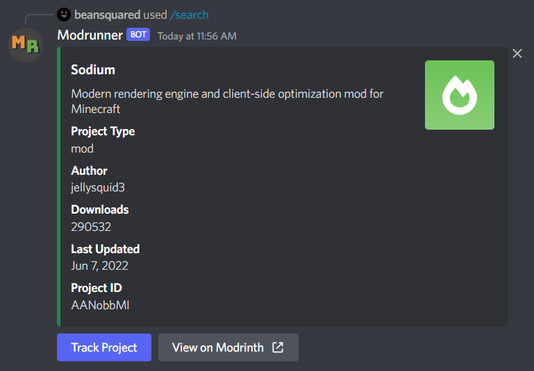
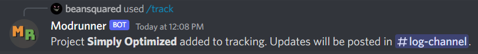

<h1 align="center">Modrunner</h1>
<em><h5 align="center">(formerly Modrinth Bot)</h5></em>

[
](https://discord.gg/HZMCRNUd5Z)    

Search for projects on Modrinth and CurseForge & get notified of updates to tracked projects, right from Discord.

# Features

- **Quick & Easy Searching** 🔍
  - Search for all types of Minecraft projects on supported platforms within Discord
  - Links to open the project's page in your web browser
  - Easily track the project to get updates posted in Discord (see below)
- **Project Update Notifications** 📨
  - Track projects on supported platforms to get notifications posted to Discord whenever the project receives an update
  - Links to open the newly uploaded file(s) page in your web browser
  - Customize your notifications with Normal and Compact embed styles

This is list not exhaustive. Invite the bot to your server today and see what else it can offer!

- **Want to try Modrunner?** Use [this link](https://discord.com/api/oauth2/authorize?client_id=978413985722404924&permissions=2048&scope=bot%20applications.commands).
- **Need help with commands?** Visit the [docs](https://modrunner.net/docs/intro/).
- **Want to contribute to Modrunner?** See [Contributing](./CONTRIBUTING.md).
- **Enjoy Modrunner?**
  - Leave a star ⭐ on the repository!
  - [Buy me a coffee ☕](https://www.buymeacoffee.com/beansquared)!

## Community & Support

