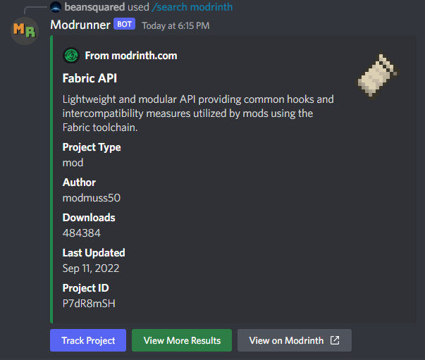
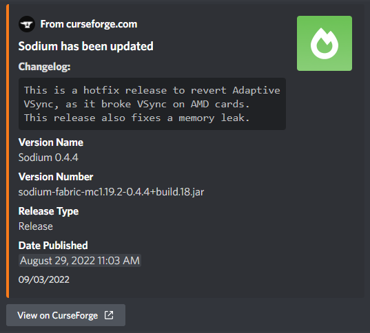

#

_(Formerly Modrinth Bot)_

    

A Discord bot to search for projects on Modrinth and CurseForge & get notified of updates to tracked projects.

Have a question about Modrunner? Open a [Q&A Discussion](https://github.com/smcmo/modrunner-bot/discussions/new) or join our [Discord](https://discord.gg/HZMCRNUd5Z).

# Features

- **Quick & Easy Searching** 🔍
  - Search for all types of Minecraft projects on supported platforms within Discord
  - Links to open the project's page in your web browser
  - Easily track the project to get updates posted in Discord (see below)
- **Project Update Notifications** 📨
  - Track projects on supported platforms to get notifications posted to Discord whenever the project receives an update
  - Links to open the newly uploaded file(s) page in your web browser
  - Customize your notifications with Normal and Compact embed styles

This is list not exhaustive. Invite the bot to your server today and see what else it can offer!

- **Want to try Modrunner?** Use [this link](https://discord.com/api/oauth2/authorize?client_id=978413985722404924&permissions=2048&scope=bot%20applications.commands).
- **Need help with commands?** Visit the [docs](https://modrunner.net/docs/intro/).
- **Want to contribute to Modrunner?** See [Contributing](./CONTRIBUTING.md).
- **Enjoy Modrunner?**
  - Leave a star ⭐ on the repository!
  - [Buy me a coffee ☕](https://ko-fi.com/beansquared)!

# Invite

[Link](https://discord.com/api/oauth2/authorize?client_id=978413985722404924&permissions=2048&scope=bot%20applications.commands)

# Commands

- `/search` - Get info about projects
- `/track` - Track projects for updates
- `/list` - List all tracked projects
- `/settings` - Customize settings

See the [docs](https://modrunner.net/docs/intro/) for more detailed information.

# Contributing

`npm run dev` - Run the application 
`npm run register` - Register application commands to a specific guild 
`npm run create-db` - Initialize the database 
`npm run reset-db` - Reset the database 
`npm run alter-db` - Alter the database 

Please check the [development board](https://github.com/smcmo/modrunner-bot/projects), or the [currently open issues](../../issues) before getting started. Issues marked with `good first issue` are ideal for first-time contributors. 
See [Contributing](./CONTRIBUTING.md) for more detailed information.
