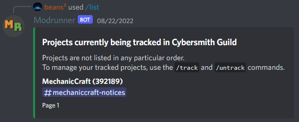

# List

Get a list of all the projects that are currently in tracking for your server, along with their names, project IDs and the channel their updates are being posted to.

## Command

`/list`

Returns a list of all projects currently being tracked for the current server.

## Result

:::tip

You can tell if a project is being tracked on CurseForge or Modrinth by looking at its ID. Modrinth project IDs are composed of both letters and numbers, while CurseForge IDs are only numbers.

:::
