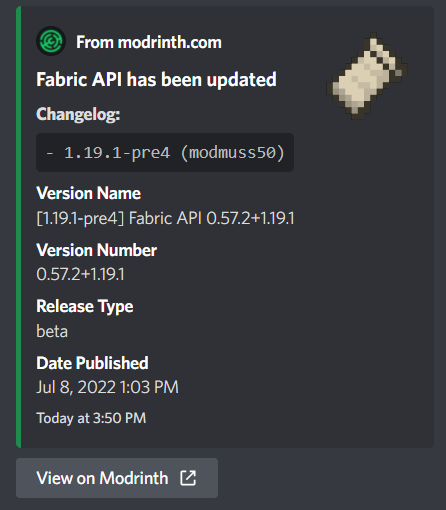
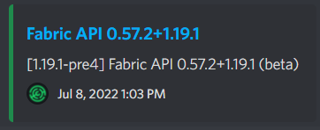

# Mode

Modrunner features different "display modes" for update notifications. You can use this command to select which one you wish to use.

## Command

`/mode <mode>`

Changes Modrunner's current display mode for update notifications. Display modes include:

- **Normal**

- **Compact**

