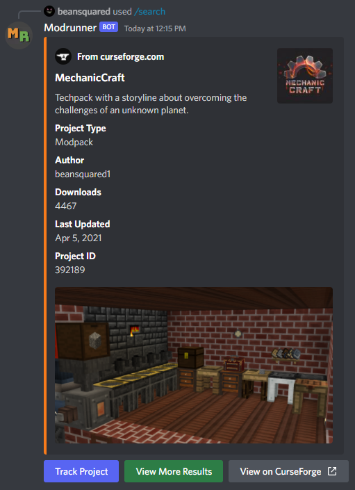
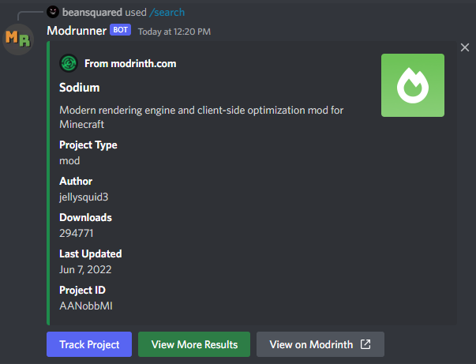

# Search

Search for projects on Modrinth and CurseForge and receive an embed with some basic information, along with a link to the project's page. Also features a "Track Project" button allowing privileged members to add the project to tracking.

## CurseForge Projects

### Command

`/search curseforge [projectName]`

Search CurseForge for projects by project name. Projects can be:

- Mods
- Modpacks
- Resource Packs
- Addons
- Worlds
- Bukkit Plugins
- Customization

### Result

`Track Project` Button

- Adds the displayed project to tracking. Has the same functionality as running the [Track](./track) command. The update channel will be the channel the original search command was executed in.

`View More Results` Button

- Displays a new embed with a list of all the results of the query, with links to each result's page on CurseForge.

`View on CurseForge` Button

- Opens the displayed project's page on CurseForge in your default web browser.

:::info

It is a known issue that CurseForge's search engine kinda sucks. If you cannot find the project you are looking for, try using the `View More Results` button and if it still isn't there, then try using the website instead.

I'm looking into ways to improve the quality of search results but this problem is largely out of my hands unfortunately.

:::

## Modrinth Projects

### Command

`/search modrinth [projectName]`

Search Modrinth for projects by project name. Projects can be:

- Mods
- Modpacks
- Plugins
- Resource Packs

### Result

`Track Project` Button

- Adds the displayed project to tracking. Has the same functionality as running the [Track](./track) command. The update channel will be the channel the original search command was executed in.

`View More Results` Button

- Displays a new embed with a list of all the results of the query, with links to each result's page on Modrinth.

`View on Modrinth` Button

- Opens the displayed project's page on Modrinth in your default web browser.
