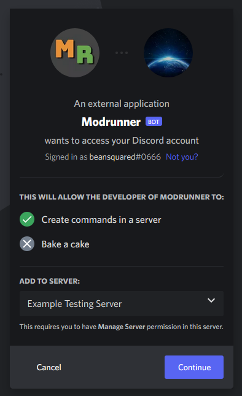
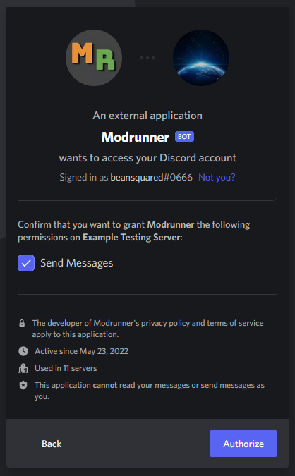
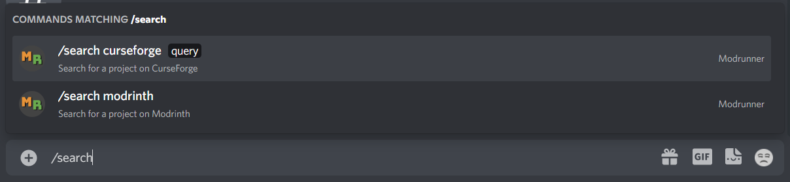
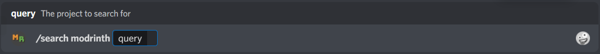
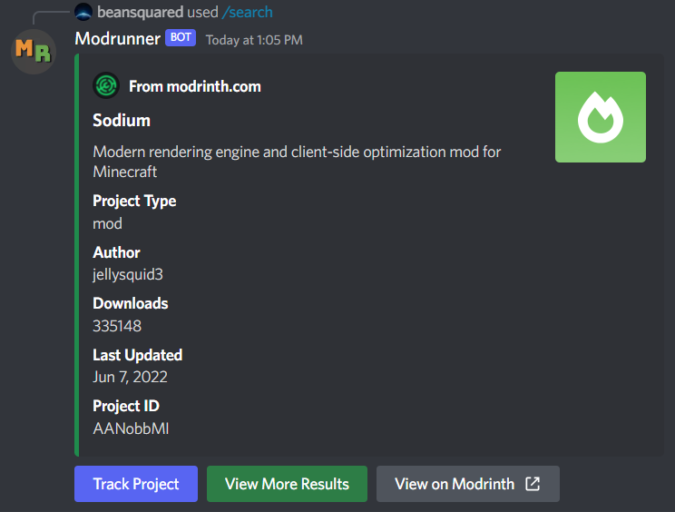
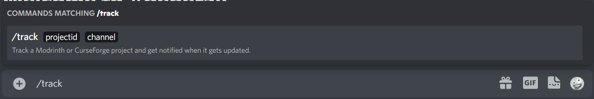
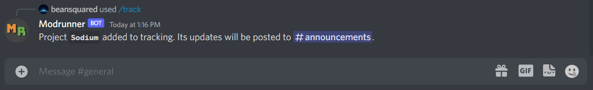

# Setting up and using Modrunner in your server

## Introduction

For this short tutorial, we will add Modrunner to a Discord server that we already own (or help administrate), learn to search for projects on Modrinth and track projects hosted on CurseForge for updates.

## Step 0: Inviting the bot to your server.

Click on the link below to start the invitation process. If you aren't already signed into Discord through your browser, you will need to do so.

You will be brought to this screen:

This lets you know that the bot will be adding some slash commands to whatever server you choose, which in our case is 'Example Testing Server'. Click Continue.

This next screen will list the permissions the bot needs in order to function. In Modrunner's case, it just needs to be able to send messages. Click Authorize. You may need to solve a CAPTCHA to do so. Once you do this, the bot will join your server and you can starting using it.

## Step 1: Searching for Projects

Searching for projects is as simple as using a search bar. Start typing the following command into a channel that Modrunner has permission to access:
`/search`

As you can see, we get two different search commands we could run. Let's choose the `/search modrinth` command, as we want to see if [this mod](https://modrinth.com/mod/sodium) is available for download on Modrinth.

This command requires a `query`, or the name of the project we want to search for. So let's type in the name `sodium` and see what Modrunner returns with.

Looks like we found what we were looking for! Note that Modrunner will always return the first result of the search query, so you may not always get exactly what you were trying to find. If this happens, you can use the View More Results button to see what other projects match the search query. You can also visit the Search page page to see more information about this command.

## Step 2: Add a Project to Tracking

Adding projects to Modrunner's tracking system will allow you to receive notifications in a server channel of your choosing when a tracked project receives an update to its files. Let's try adding that same project we just searched for to tracking, but instead we want to see when it gets updated on CurseForge instead.

Start by typing out `/track`.

In this case, we only have one command. Luckily we don't need separate commands for Modrinth and CurseForge, since Modrunner is smart enough to know where a project is hosted based on its ID. Let's track Sodium, whose project ID is `394468`. Let's also specify that we want updates posted to our `#announcements` channel.

Once the bot successfully adds that project to tracking, Modrunner will verify the name of the mod and the channel that the project's updates will be posted to.

And that's it! You will now receive notifications when that project get updated!
